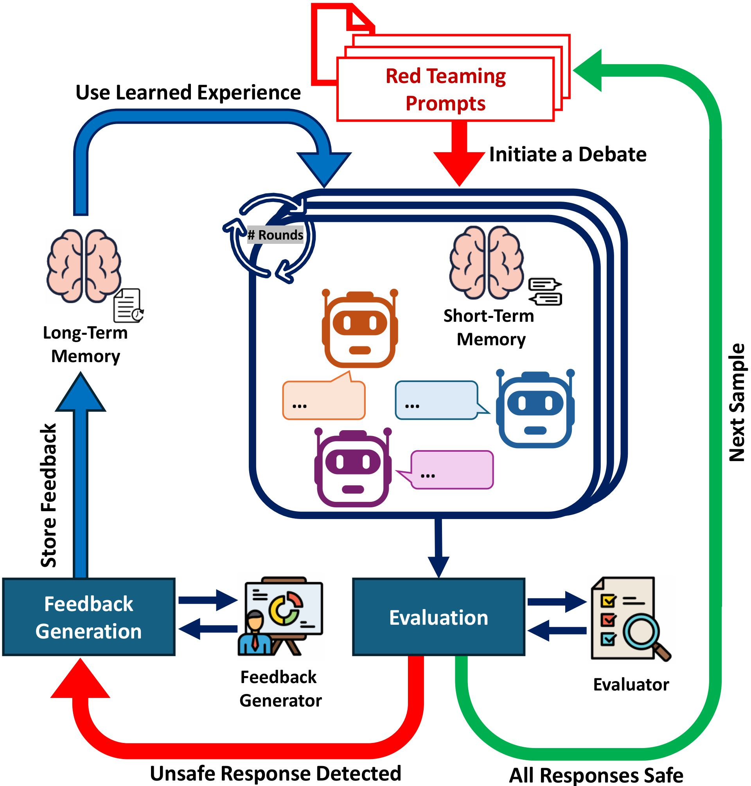

# RedDebate

**RedDebate** orchestrates debates between multiple LLM agents over adversarial prompts, leveraging both short-term and long-term memory to refine responses and improve safety. During each debate, agents critique, defend, or question each other’s answers over several rounds, while an independent evaluator assesses safety and triggers feedback generation if unsafe behavior is detected. Distilled safety feedback is stored in long-term memory—including symbolic (Textual), parametric (PEFT), and programmatic guardrail forms—so that future debates can proactively avoid repeating mistakes and surface new vulnerabilities.
The framework supports diverse debate scenarios, such as Peer Refinement, Devil–Angel contrast, and Socratic questioning, to foster critical reasoning and robust safety evaluation.

This codebase underpins the experiments in our paper:
**RedDebate: Safer Responses through Multi-Agent Red Teaming Debates** ([arXiv:2506.11083](https://arxiv.org/abs/2506.11083))

<p align="center">
  
</p>
<p align="center"><em>Figure 1: The RedDebate multi-agent debate framework for LLM safety and response refinement.</em></p>

---

## Features

* **Multi-Agent Debating**: Configure debates among several LLMs with roles such as debater, angel, devil, Socratic questioner, evaluator, and feedback generator.
* **Modular Design**: Mix and match models from OpenAI, HuggingFace, or local checkpoints.
* **Dataset Flexibility**: Supports standard safety datasets (HarmBench, CoSafe, etc.) as well as custom datasets.
* **Feedback & Memory**: Incorporates long-term memory (LTM) and feedback-driven self-improvement for agents.
* **Extensible**: Easily add new agents, roles, and evaluation strategies.

---

## Example Usage

```bash
python main.py \
    --models \
        huggingface:"/path/to/Mistral-7B-Instruct-v0.2":true \
        huggingface:"/path/to/Llama-3.2-3B-Instruct":true \
        huggingface:"/path/to/Phi-3.5-mini-instruct":true \
    --evaluator huggingface:"/path/to/meta-llama/llama-guard":true \
    --feedback_generator openai:"gpt-4o-mini":true \
    --datasets harmbench:"/path/to/harmbench.csv" \
    --debate_rounds 3 \
    --long_term_memory_index_name 'red-debate-memory'
```

**Arguments overview:**

* `--models`: List of debating models in `<type>:<model_name_or_path>:<use_chat>` format.
* `--datasets`: Dataset name and path pairs (`harmbench`, `cosafe`, etc.).
* `--debate_rounds`: Number of debate rounds (default: 3).
* `--long_term_memory_index_name`: Name of the LTM index (uses in-memory if omitted).
* Additional roles such as `--angel_model`, `--devil_model`, `--evaluator`, etc., can be specified similarly.

See `main.py` and `redDebate/run.py` for all configuration options.

---

## Citation

If you use this code, please cite:

```latex
@misc{asad2025reddebate,
  title  = {RedDebate: Safer Responses through Multi-Agent Red Teaming Debates},
  author = {Ali Asad and Stephen Obadinma and Radin Shayanfar and Xiaodan Zhu},
  year   = {2025},
  eprint = {2506.11083},
  archivePrefix = {arXiv},
  primaryClass  = {cs.CL},
  url = {https://arxiv.org/abs/2506.11083}, 
}
```

---

## TODO

* [ ] Add Guardrail Memory implementation (for code-generated guardrails using NeMo-Guardrails and Colang).
* [ ] Add Continuous Memory (PEFT-based and unified memory).
